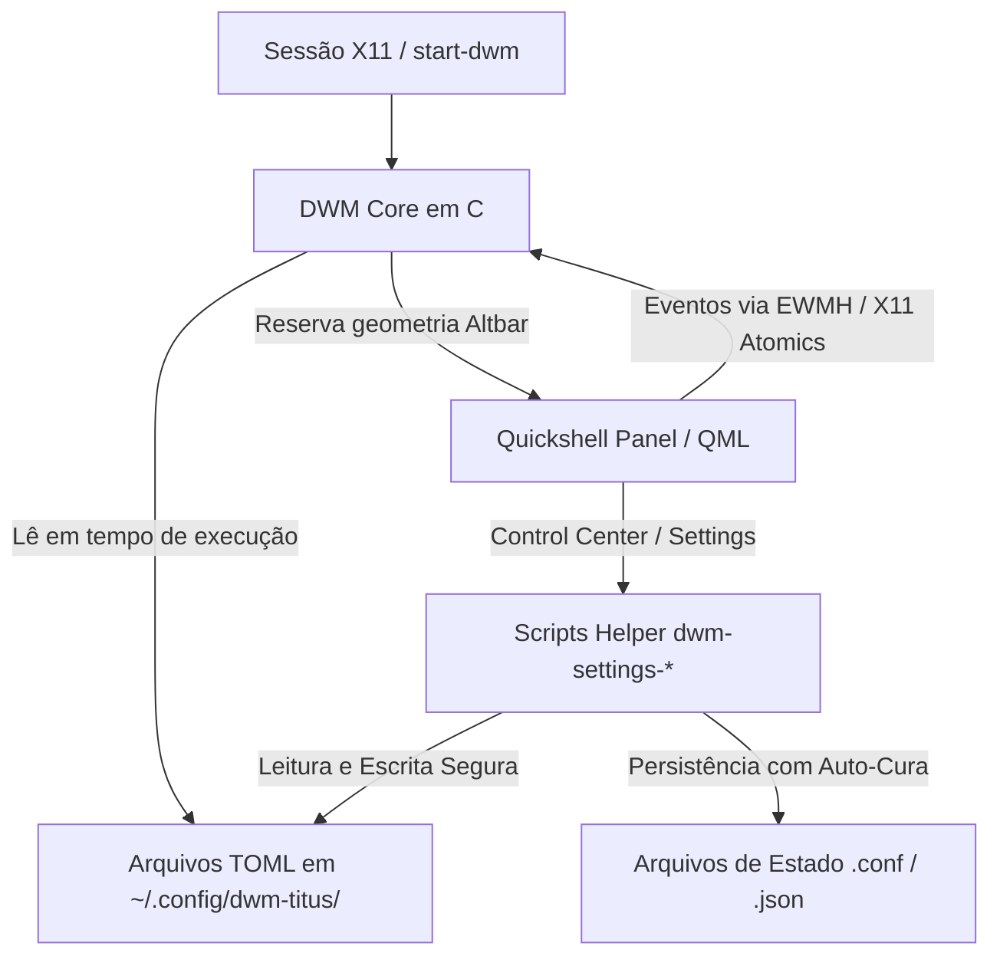

# 👑 Guia & Wiki de Customização do DWM-Titus & Quickshell (X11)

Este documento é a referência completa para a customização, manutenção e extensão do **DWM** e do **Quickshell** integrado no ecossistema `nixfiles`. Ele explica a arquitetura híbrida única deste ambiente, a estrutura de arquivos da pasta `dwm/`, os três níveis de customização (TOML em tempo de execução, QML reativo ao vivo e código-fonte em C), além de boas práticas de segurança, resolução de problemas comuns e tabela de atalhos.

---

## 📑 Sumário

1. [Visão Geral e Arquitetura Híbrida](#-1-visão-geral-e-arquitetura-híbrida)
2. [Estrutura de Pastas e Arquivos](#-2-estrutura-de-pastas-e-arquivos)
3. [Como o Nix Compila e Provisiona o DWM](#-3-como-o-nix-compila-e-provisiona-o-dwm)
4. [Os Três Níveis de Customização](#-4-os-três-níveis-de-customização)
   - [Nível 1: Configuração em Tempo de Execução via TOML](#nível-1-configuração-em-tempo-de-execução-via-toml)
   - [Nível 2: Interface, Barra e Menus Reativos via Quickshell (QML)](#nível-2-interface-barra-e-menus-reativos-via-quickshell-qml)
   - [Nível 3: Configurações Nativas e Patches em C](#nível-3-configurações-nativas-e-patches-em-c)
5. [Guia Prático Passo a Passo](#-5-guia-prático-passo-a-passo)
   - [5.1 Alterar ou Adicionar Atalhos de Teclado (`hotkeys.toml`)](#51-alterar-ou-adicionar-atalhos-de-teclado-hotkeystoml)
   - [5.2 Regras de Janelas (`window-rules.toml` - Tiled vs Floating)](#52-regras-de-janelas-window-rulestoml---tiled-vs-floating)
   - [5.3 Adicionar ou Modificar Temas de Cores (`themes.toml`)](#53-adicionar-ou-modificar-temas-de-cores-themestoml)
   - [5.4 Customizar a Barra e Componentes do Quickshell (Live Mode)](#54-customizar-a-barra-e-componentes-do-quickshell-live-mode)
   - [5.5 Configurar Inicialização Automática (`autostart.sh` e XDG)](#55-configurar-inicialização-automática-autostartsh-e-xdg)
   - [5.6 Efeitos Visuais, Transparência e Blur (Picom)](#56-efeitos-visuais-transparência-e-blur-picom)
   - [5.7 Alternar o Tipo de Barra de Status](#57-alternar-o-tipo-de-barra-de-status)
   - [5.8 Adicionar Pacotes e Dependências ao Ambiente](#58-adicionar-pacotes-e-dependências-ao-ambiente)
6. [Gerenciamento de Estado, Permissões e Segurança](#-6-gerenciamento-de-estado-permissões-e-segurança)
7. [Tabela de Atalhos do Teclado (Cheat Sheet)](#-7-tabela-de-atalhos-do-teclado-cheat-sheet)
8. [Diagnóstico, Validação e Troubleshooting](#-8-diagnóstico-validação-e-troubleshooting)

---

## 🌟 1. Visão Geral e Arquitetura Híbrida

O DWM presente neste repositório é baseado no **DWM-Titus** (suíte desenvolvida por Chris Titus — [dwm.christitus.com](https://dwm.christitus.com/)), adaptado declarativamente para **Nix Flakes** e **Home Manager**.

Diferente do DWM upstream da Suckless (onde qualquer alteração exige recompilar todo o código C), este ambiente utiliza uma **arquitetura híbrida modular em três camadas**:



### Principais Pilares da Arquitetura:
1. **C Core Dinâmico**: O executável `dwm` traz embutido um parser TOML (`tomlparser.c`) que lê atalhos, regras de janelas e temas diretamente de arquivos de configuração em disco, sem necessidade de recompilação para mudanças cotidianas.
2. **Altbar Quickshell**: Painel de status moderno renderizado via QtQuick / QML, com suporte a *Live Mode* (hot reload instantâneo), Control Center retrátil, lançador de aplicativos, histórico de clipboard, central de notificações e applets integrados.
3. **Modelos Reativos com Verificação Estrita**: Scripts auxiliares (`dwm-settings-*`, `dwm-panel-settings`, `dwm-quickshell-controlcenter`) realizam leitura e mutação atômica dos estados do sistema, emitindo dados formatados para os modelos QML consumirem.

---

## 🗂️ 2. Estrutura de Pastas e Arquivos

Toda a infraestrutura do DWM está isolada em `modules/home-manager/desktop/environments/dwm/`:

```
modules/home-manager/desktop/environments/dwm/
├── default.nix                  # Ativação do módulo, opções globais e importações
├── dwm.nix                      # Derivação Nix (dwmPackage), sessão X11 e hooks de ativação
├── packages.nix                 # Ferramentas de sistema, bloqueio, captura e X11
├── picom.nix                    # Compositor Picom (sombras, transparências e cantos arredondados)
├── rofi.nix                     # Menu Rofi e Power Menu integrados
├── dunst.nix                    # Notificador Dunst (ativado quando não usa Quickshell)
├── README.md                    # Esta documentação
└── configs/                     # Árvore do código-fonte C, scripts e templates
    ├── Makefile                 # Regras de compilação GNU Make
    ├── config.def.h             # Configurações base em C (fallback de compilação)
    ├── config.mk                # Flags de compilação e dependências de cabeçalho
    ├── dwm.c                    # Código-fonte principal do Window Manager
    ├── drw.c / drw.h            # Biblioteca de renderização gráfica Xlib/Xft
    ├── tomlparser.c / .h        # Parser TOML em C integrado ao DWM
    ├── util.c / util.h          # Funções utilitárias auxiliares
    ├── config/                  # Templates padrão de configuração e estado
    │   ├── hotkeys.toml         # Definição de todos os atalhos de teclado
    │   ├── window-rules.toml    # Regras de comportamento e flutuação de janelas
    │   ├── themes.toml          # Paletas e temas de cores
    │   ├── panel-widgets.conf   # Visibilidade dos widgets da barra (Workspaces, Volume, etc.)
    │   ├── font.conf            # Fonte padrão da interface e escala
    │   ├── accessibility.conf   # Contraste e movimento reduzido
    │   ├── notification-settings.json # Configurações da central de notificações
    │   ├── wallpaper.conf       # Estado e modo do papel de parede
    │   ├── personalization.conf # Integração de fontes e interface GNOME/GTK
    │   ├── theme-env.sh         # Variáveis de tema exportadas para a sessão
    │   ├── cursor.Xresources    # Tema e tamanho do cursor X11
    │   ├── xsettingsd.conf      # Daemon XSettings para DPI e fontes GTK
    │   └── quickshell/          # Todo o frontend QML (Barra, Control Center, Settings)
    └── scripts/                 # Scripts de apoio, status e integração
        ├── autostart.sh         # Script mestre de autoinicialização da sessão
        ├── dwm-status           # Script de fallback para barra clássica via xsetroot
        ├── dwm-lock             # Despachante inteligente de screen locker (betterlockscreen/i3lock)
        ├── dwm-quickshell-state # Exportador de estado do X11 (workspaces, janelas) para o QML
        ├── dwm-settings-*       # Handlers de mutação de configurações do sistema
        └── theme-apply.sh       # Aplicador de paletas em múltiplos dotfiles
```

---

## 🔨 3. Como o Nix Compila e Provisiona o DWM

No arquivo [dwm.nix](file:///home/juca/.dotfiles/nixfiles/modules/home-manager/desktop/environments/dwm/dwm.nix), o DWM é compilado como um pacote isolado do Nix:

1. **Compilação (`dwmPackage`)**:
   - O `pkgs.stdenv.mkDerivation` compila os fontes da pasta `configs/` usando `libX11`, `libXft`, `libXinerama`, `libXrender`, `libXcursor`, `imlib2` e `fontconfig`.
   - Gera o binário `dwm` em `$out/bin/`.
   - Instala todos os scripts de `configs/scripts/` em `$out/bin/` e fallbacks em `$out/share/dwm-titus/`.
2. **Hook de Ativação (`setupDwmConfig`)**:
   - Ao executar `home-manager switch`, este hook prepara o ambiente do usuário:
   - Garante que `~/.config/dwm-titus` e `~/.config/quickshell` sejam **diretórios reais graváveis** (removendo symlinks imutáveis do store se existirem).
   - Se os arquivos de configuração (`hotkeys.toml`, `themes.toml`, `panel-widgets.conf`, etc.) não existirem ou estiverem vazios (0 bytes), copia automaticamente o template válido correspondente de `configs/config/`.
   - Aplica permissões de segurança estritas (`chmod 700` no diretório e `chmod 600` / `go-w` nos arquivos).

---

## 🎚️ 4. Os Três Níveis de Customização

Ao planejar uma mudança, determine em qual nível ela se enquadra para economizar tempo:

### Nível 1: Configuração em Tempo de Execução via TOML
- **Arquivos**: `hotkeys.toml`, `window-rules.toml`, `themes.toml`.
- **Velocidade**: Imediato (sem recompilar).
- **Como testar**: Edite diretamente em `~/.config/dwm-titus/` e pressione `SUPER + SHIFT + r` (para hotkeys/regras) ou selecione o tema no Control Center.
- **Como persistir**: Copie a alteração para a pasta `configs/config/` correspondente para que futuras máquinas ou switches mantenham a alteração.

### Nível 2: Interface, Barra e Menus Reativos via Quickshell (QML)
- **Arquivos**: `configs/config/quickshell/**/*.qml`.
- **Velocidade**: Instantâneo (Hot Reload / Live Mode).
- **Como testar**: Abra qualquer arquivo `.qml` em `~/.config/quickshell/`, faça uma alteração e salve. A barra ou janela atualiza ao vivo na tela.
- **Como persistir**: Copie os arquivos alterados para `modules/home-manager/desktop/environments/dwm/configs/config/quickshell/`.

### Nível 3: Configurações Nativas e Patches em C
- **Arquivos**: `configs/dwm.c`, `configs/config.def.h`, `configs/drw.c`.
- **Velocidade**: Exige compilação rápida do pacote pelo Nix.
- **Como aplicar**: Execute `home-manager switch --flake .#juca@<host>`.

---

## 📖 5. Guia Prático Passo a Passo

### 5.1 Alterar ou Adicionar Atalhos de Teclado (`hotkeys.toml`)

Os atalhos são definidos em formato TOML. 

#### Exemplo em `configs/config/hotkeys.toml`:
```toml
[vars]
term = "alacritty"
filemanager = "file-manager"

[[keys]]
# Abrir terminal
{ mod="SUPER", key="Return", desc="Abrir Terminal", func="spawn", cmd="alacritty" },

# Abrir Gerenciador de Arquivos Agnóstico
{ mod="SUPER", key="e", desc="File manager", func="spawn", exec=["$filemanager"] },

# Bloquear Tela
{ mod="SUPER SHIFT", key="x", desc="Lock screen", func="spawn", cmd="dwm-lock || loginctl lock-session" },

# Controle de Janelas
{ mod="SUPER", key="q", desc="Fechar janela", func="killclient", i=0 },
{ mod="SUPER", key="space", desc="Alternar Master e Stack", func="zoom", i=0 },
{ mod="SUPER", key="f", desc="Alternar tela cheia", func="togglefullscreen", i=0 },
{ mod="SUPER SHIFT", key="space", desc="Alternar flutuante", func="togglefloating", i=0 },

# Alternar Layouts
{ mod="SUPER", key="t", desc="Layout Tiled", func="setlayout", s="[]=" },
{ mod="SUPER", key="m", desc="Layout Monocle", func="setlayout", s="[M]" },

# Recarregar Configurações e Atalhos
{ mod="SUPER SHIFT", key="r", desc="Recarregar DWM e Atalhos", func="quit", i=1 },
```

> ⚠️ **Atenção**: Evite atribuir o mesmo atalho para funções diferentes. O X11 captura apenas a primeira ocorrência via `XGrabKey`.

---

### 5.2 Regras de Janelas (`window-rules.toml` - Tiled vs Floating)

Define como janelas de aplicativos específicos devem se comportar ao serem abertas.

#### Estrutura em `configs/config/window-rules.toml`:
```toml
# Abre o pavucontrol como janela flutuante e centralizada
{ class="Pavucontrol", isfloating=1, iscentered=1, monitor=-1, tags=0 },

# Abre o visualizador de imagens sxiv sempre flutuante
{ class="Sxiv", isfloating=1, iscentered=1, monitor=-1, tags=0 },

# Envia o reprodutor de mídia para a Tag 5 automaticamente
{ class="mpv", isfloating=1, iscentered=1, monitor=-1, tags=16 },

# Diálogos modais e seletores de arquivos
{ class="GtkFileChooserDialog", isfloating=1, iscentered=1, monitor=-1, tags=0 },
```

> 💡 **Nota Importante**: O parser do DWM busca estritamente o atributo **`isfloating`** (não utilize `float`, pois será ignorado pelo C).

Para descobrir a classe (`class`) de uma janela aberta, rode no terminal:
```bash
xprop WM_CLASS
```
E clique na janela desejada.

---

### 5.3 Adicionar ou Modificar Temas de Cores (`themes.toml`)

Os temas controlam as cores de borda, barra e elementos gráficos.

#### Estrutura em `configs/config/themes.toml`:
```toml
[active]
theme = "catppuccin-mocha"

[catppuccin-mocha]
norm_bg = "#1e1e2e"
norm_fg = "#cdd6f4"
norm_border = "#313244"
sel_bg = "#89b4fa"
sel_fg = "#11111b"
sel_border = "#cba6f7"
title_bg = "#1e1e2e"
title_fg = "#cdd6f4"
title_border = "#313244"
```

Para aplicar um tema via linha de comando:
```bash
dwm-settings-theme apply catppuccin-mocha
```

---

### 5.4 Customizar a Barra e Componentes do Quickshell (Live Mode)

O Quickshell monitora alterações de arquivos automaticamente em tempo real!

1. Navegue até `~/.config/quickshell/`.
2. Arquivos principais:
   - `panel/DwmPanel.qml`: Geometria, altura, margens e disposição dos módulos da barra.
   - `panel/PanelSettingsModel.qml`: Habilitação e desabilitação dinâmica dos widgets.
   - `controlcenter/ControlCenterWindow.qml`: Menu lateral retrátil (Wi-Fi, Bluetooth, Áudio, Auto Lock).
   - `settings/SettingsWindow.qml`: Janela de configurações central do sistema.
   - `launcher/LauncherWindow.qml`: Menu lançador de aplicativos com busca instantânea.
3. Edite qualquer propriedade visual (cores, espaçamentos, ícones) e salve o arquivo.
4. O Quickshell recarrega a interface no mesmo instante na tela, sem fechar suas janelas.
5. Após concluir seus ajustes visuais, copie o arquivo de volta para o repositório:
   ```bash
   cp ~/.config/quickshell/caminho/Arquivo.qml modules/home-manager/desktop/environments/dwm/configs/config/quickshell/caminho/
   ```

---

### 5.5 Configurar Inicialização Automática (`autostart.sh` e XDG)

Existem duas formas de iniciar programas automaticamente no login do DWM:

1. **Via Script Mestre**: Edite [`modules/.../dwm/configs/scripts/autostart.sh`](file:///home/juca/.dotfiles/nixfiles/modules/home-manager/desktop/environments/dwm/configs/scripts/autostart.sh). Utilize a função `start_detached_once <processo>` para evitar instâncias duplicadas.
2. **Via XDG Autostart Padrão**: Arquivos `.desktop` colocados em `~/.config/autostart/` são executados automaticamente pelo helper `dwm-xdg-autostart`.

---

### 5.6 Efeitos Visuais, Transparência e Blur (Picom)

O Picom é gerenciado pelo Home Manager no arquivo [picom.nix](file:///home/juca/.dotfiles/nixfiles/modules/home-manager/desktop/environments/dwm/picom.nix).

- **Habilitar/Desabilitar**:
  ```nix
  desktop.dwm.picom.enable = true; # ou false
  ```
- **Customização Fina**: O template `configs/config/picom.conf` permite ajustar cantos arredondados (`corner-radius`), opacidade inativa/ativa e exclusões de janelas para sombras e blur.

---

### 5.7 Alternar o Tipo de Barra de Status

Você pode trocar a barra de status facilmente no seu arquivo de host ou configuração:

```nix
desktop.dwm.bar = "quickshell"; # Padrão: rica, interativa, com painéis e menus
# Outras opções suportadas:
# desktop.dwm.bar = "dwm-status"; # Script clássico leve via xsetroot
# desktop.dwm.bar = "slstatus";   # Status bar ultraleve em C puro
# desktop.dwm.bar = "polybar";    # Polybar integrada
# desktop.dwm.bar = "none";       # Sem barra externa
```

Ao selecionar `"dwm-status"` ou `"slstatus"`, o daemon de notificações Dunst é reativado automaticamente para garantir que você continue recebendo alertas do sistema.

---

### 5.8 Adicionar Pacotes e Dependências ao Ambiente

Se você precisar de novas ferramentas ou comandos disponíveis no ambiente DWM:
1. Abra [packages.nix](file:///home/juca/.dotfiles/nixfiles/modules/home-manager/desktop/environments/dwm/packages.nix).
2. Adicione os pacotes desejados na lista `home.packages = with pkgs; [ ... ];`.
3. Aplique com `home-manager switch`.

---

## 🔒 6. Gerenciamento de Estado, Permissões e Segurança

O DWM-Titus implementa **mecanismos de proteção contra corrupção e escalonamento de privilégios**:

1. **Permissões Estritas Obrigatórias**:
   - O diretório `~/.config/dwm-titus/` **deve** possuir permissões `700` (`drwx------`).
   - Os arquivos de configuração (`panel-widgets.conf`, `font.conf`, etc.) devem ser de posse do seu usuário (`$UID`) e sem permissão de escrita para grupo/outros (`go-w` ou `600`).
2. **Auto-Cura (`Self-Healing`)**:
   - Os scripts `dwm-panel-settings` e `dwm-accessibility-settings` contêm rotinas de auto-cura integradas: caso identifiquem bits de grupo legados (gerados por umasks frouxas), ajustam a permissão automaticamente via `chmod go-w` antes da validação, prevenindo bloqueios na interface.
3. **Nunca utilize `touch` em arquivos de estado**:
   - Arquivos vazios de 0 bytes falham nas verificações de integridade dos parsers (que esperam linhas de protocolo como `panel-settings-protocol\t1\t0`). Se precisar restaurar um arquivo, copie sempre o template correspondente de `configs/config/`.

---

## ⌨️ 7. Tabela de Atalhos do Teclado (Cheat Sheet)

A tecla modificadora padrão é `SUPER` (tecla Windows / Command no Mac).

| Atalho | Ação |
| :--- | :--- |
| `SUPER + Return` | Abre o Terminal padrão (`alacritty`) |
| `SUPER + d` | Abre o Lançador de Aplicativos (Rofi / Quickshell Launcher) |
| `SUPER + e` | Abre o Gerenciador de Arquivos (`file-manager` / `thunar`) |
| `SUPER + q` | Fecha a janela em foco |
| `SUPER + Shift + x` | Bloqueia a tela instantaneamente (`dwm-lock`) |
| `SUPER + Shift + e` | Abre o Menu de Energia / Logout (`session-power-menu`) |
| `SUPER + Space` | Promove a janela em foco para a janela Master (ou alterna com a anterior) |
| `SUPER + j` / `SUPER + k` | Alterna o foco para a próxima/anterior janela no stack |
| `SUPER + Shift + j` / `k` | Move a posição física da janela na pilha |
| `SUPER + h` / `SUPER + l` | Reduz / Expande a largura da área Master |
| `SUPER + i` / `SUPER + u` | Aumenta / Diminui o número de janelas na área Master |
| `SUPER + t` | Define o layout como Tiled (`[]=`) |
| `SUPER + m` | Define o layout como Monocle (`[M]` - janela única em tela cheia) |
| `SUPER + f` | Alterna estado de Tela Cheia real (Fullscreen) |
| `SUPER + Shift + Space` | Alterna a janela atual entre Flutuante e Tiled |
| `SUPER + 1` até `9` | Muda para o Workspace / Tag de 1 a 9 |
| `SUPER + Shift + 1` até `9`| Move a janela em foco para o Workspace / Tag correspondente |
| `SUPER + Tab` | Alterna para o último Workspace visualizado |
| `SUPER + Shift + r` | **Recarrega as configurações e atalhos do DWM** |

---

## 🩺 8. Diagnóstico, Validação e Troubleshooting

Se algo apresentar comportamento inesperado, utilize estes comandos de diagnóstico no terminal:

### 1. Testar Status dos Widgets do Painel
```bash
dwm-panel-settings status
```
*Saída esperada*: `state available` com cada widget (`workspaces`, `volume`, etc.) listado como `enabled`.

### 2. Testar Status de Bloqueio e Energia (Auto Lock)
```bash
dwm-quickshell-controlcenter power-status
```
*Saída esperada*: `lock_available 1` e `lock_malformed 0`.

### 3. Inspecionar Capacidades do Sistema (Settings Provider)
```bash
dwm-settings-provider discover
```
*Verifique*: Todas as capacidades de `appearance`, `power`, `input` e `defaults` devem exibir `available user-session`.

### 4. Testar Prontidão de Temas (Mutation Ready)
```bash
dwm-settings-theme mutation-ready && echo "Tema OK (Gravável)" || echo "Tema em Read-Only"
```

### 5. Ver Logs em Tempo Real do Quickshell
Caso o painel ou barra não abra, verifique o log detalhado:
```bash
cat ~/.local/state/dwm-titus/quickshell.log
```

### 6. Validação e Aplicação Cirúrgica do Flake
```bash
# Validação rápida de sintaxe sem compilar pacotes:
nix flake check --no-build

# Aplicar alterações no ambiente:
home-manager switch --flake .#juca@<host>
```
